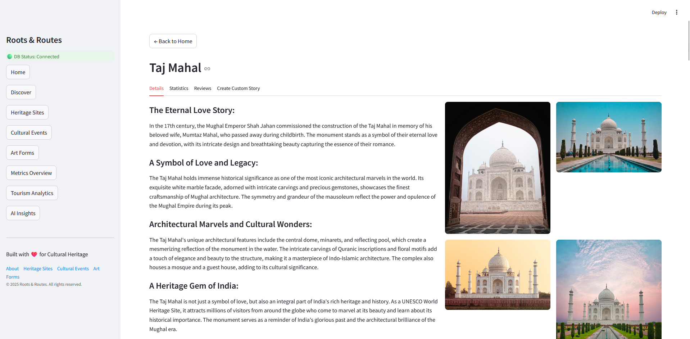
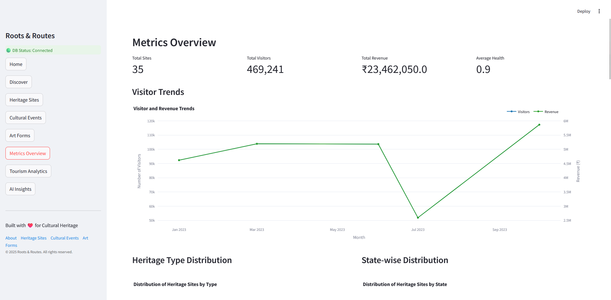
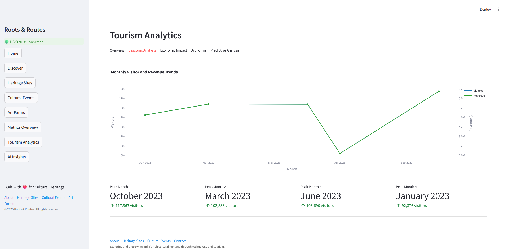
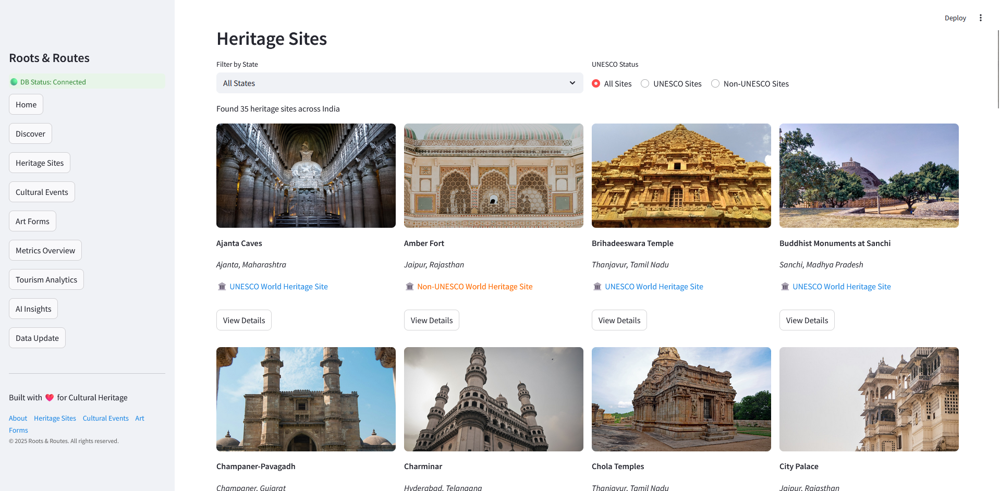

# Roots and Routes

Roots & Routes is an innovative digital platform dedicated to preserving and promoting India's rich cultural heritage. Our mission is to bridge the gap between traditional cultural assets and modern technology, making heritage sites, art forms, and cultural events more accessible and engaging for everyone.

## Key Features

### AI Insights
- Identify heritage sites with least visitors trends
- Identify heritage sites with high visitors trends
- Site Insights - Health Score, Tourism Potential, Seasonality, Preservation
- Suggestions for heritage sites with high tourism potential
- Recommendations for heritage sites with high preservation risk

### Tourism Analytics
- Overview of all heeritage sites accross India
- Detailed information about UNESCO World Heritage Sites
- Seasonal Analysis, Economic Impact, Art Forms and Predictive Analysis
- Peak months, Seasonal Trends, Trend Analysis
- Revenue and per Visitor Trends
- Top 10 Art forms
- Month-on-month visitor growth rate

### Heritage Sites Explorer
- Interactive map visualization of heritage sites across India
- Detailed information about UNESCO World Heritage Sites
- Visitor statistics and health monitoring
- Rich media gallery with high-quality images
- User reviews and ratings system

### Cultural Events
- Comprehensive database of cultural events and festivals
- State-wise and category-wise filtering

### Art Forms Showcase
- Extensive collection of traditional and contemporary art forms
- Detailed information about practitioners and techniques
- Risk level assessment for endangered art forms
- Art form preservation initiatives

### Analytics Dashboard
- Total Sites, Visitors, Revenue, Ratings and Average Health
- Visitor Trends Graph
- Heritage type distribution and State wise distribution
- Trending Heritage Sites

## Screenshots

<table>
<tr>
<td></td>
<td></td>
</tr>
<tr>
<td></td>
<td></td>
</tr>
<tr>
<td></td>
<td></td>
</tr>
<tr>
<td></td>
<td></td>
</tr>
<tr>
<td></td>
<td></td>
</tr>
<tr>
<td></td>
<td></td>
</tr>
<tr>
<td></td>
<td></td>
</tr>
<tr>
<td></td>
<td></td>
</tr>
<tr>
<td></td>
<td></td>
</tr>
</table>

## Technical Specifications
- **Streamlit** - Custom-built components
- **Responsive Design**: Mobile-first approach
- **Interactive Elements**: Maps, charts, and galleries
- **Database Integration**: Snowflake and ETL to load data from files and other sources

## Getting Started

## Clone the repository
```
git clone https://github.com/base234/Roots-and-Routes
```

## Navigate to the project directory
```
cd Roots-and-Routes
```

## Activate virtual environment
```
python -m venv venv
```

## For Linux systems
```
source venv/bin/activate
```

## For Windows systems
```
.\venv\Scripts\activate.bat
```

## Install dependencies
```
pip install -r requirements.txt
```

## Setup environtment file
- Rename the **.env.example** file to **.env**
- Now, update the values in the **.env** file with your credentials

## Run the app
```
python -m streamlit run src/app.py
```

### For Linux systems
```
streamlit run src/app.py
```

### For Windows systems
```
streamlit run src\app.py
```

## Acknowledgments
- UNESCO for heritage site data
- Ministry of Culture, Government of India for cultural event data. 
